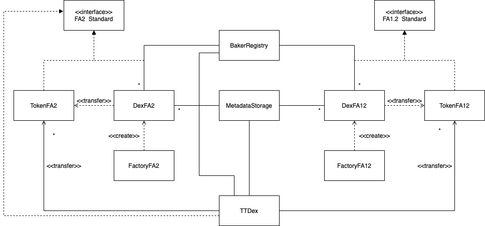

# Description

This project is intended to provide an easy and efficient way to exchange tokens and XTZ on Tezos blockchain in a wide number of directions. Using smart contracts listed in this repo users can add their tokens to exchange, invest liquidity, and potentially make a profit in a fully decentralized way.

The current implementation supports [FA1.2](https://gitlab.com/tzip/tzip/-/blob/master/proposals/tzip-7/tzip-7.md) and [FA2](https://gitlab.com/tzip/tzip/-/blob/master/proposals/tzip-7/tzip-12.md).

# Architecture



The solution consists of 3 types of contracts:

1. `Factory` - singleton used to deploy new exchange pair;
2. `Dex` - contract for TokenX-XTZ pair exchanges;
3. `Token` - FA token implementation.

# Project structure

```
.
├──  contracts/ # contract sources for FA1.2 compatible version
├──  testTs/ # test cases
├──  storage/ # initial storage for contract origination
├──  scripts/ # cli for dex/factory actions
├──  README.md # current file
├──  .gitignore
├──  package.json
└──  Architecture.png
```

# Prerequisites

- Installed NodeJS (tested with NodeJS v12+)
- Installed Truffle:

```
npm install -g truffle@tezos

```

- Installed ganache-cli:

```
npm install -g ganache-cli@tezos

```

- Installed Ligo:

```
curl https://gitlab.com/ligolang/ligo/raw/dev/scripts/installer.sh | bash -s "next"
```

- Installed node modules:

```
cd quipuswap-core && npm i
```

- Configure `truffle-config.js` if [needed](https://www.trufflesuite.com/docs/tezos/truffle/reference/configuring-tezos-projects).

# Usage

Contracts are processed in the following stages:

1. Compilation
2. Deployment
3. Configuration
4. Interactions on-chain

## Compilation

To compile the contracts run:

```
npm run compile
```

Artifacts are stored in the `build/contracts` directory.

## Deployment

For deployment step the following command should be used:

```
npm run migrate
```

Addresses of deployed contracts are displayed in terminal. At this stage, new Factory, two new pairs are originated.

# Entrypoints

## Factory

- `launchExchange(token: address, tokenAmount: nat)`: deploys a new empty `Dex` for `token`, stores the address of the new contract and put initial liquidity; has to be called with tezos amount that will be used as intial liquidity.
- `setFunction(func : (dexAction, dex_storage, address) -> (list(operation), dex_storage)), funcIndex: nat`: adds lambda to functions map; the map will be replicated in storage of originated `Dex` contracts.

## Dex

- `default()`: default entrypoint to receive payments; received XTZ are destributed between liquidity providers in the end of the delegation cycle.
- `use(funcIndex: nat, action: dexAction)`: executes the function with index `funcIndex` from `lambdas` with parameters `action`.

Actions have the following parameters (index in the list matches the index in `lambdas`):

0. `initializeExchange(tokenAmount: nat)`: sets initial liquidity, XTZ must be sent.
1. `tezToToken(minTokensOut: nat, receiver: address)`: exchanges XTZ to tokens and sends them to `receiver`; operation is reverted if the amount of exchanged tokens is less than `minTokensOut`.
2. `tokenToTez(tokensIn: nat, minTezOut: nat, receiver: address)`: exchanges `tokensIn` tokens to XTZ and sends them to `receiver`; operation is reverted if the amount of exchanged XTZ is less than `minTezOut`.
3. `withdrawProfit(receiver: address)`: withdraws delegation reward of the sender to `receiver` address.
4. `investLiquidity(minShares: nat)`: allows to own `minShares` by investing tokens and XTZ; the corresponding amount of XTZ has to be sent via transaction and amount of tokens has to be approved to be spent by `Dex`.
5. `divestLiquidity(minTezDivested: nat, minTokensDivested: nat, sharesBurned: nat)`: divests `sharesBurned` and sends tokens and XTZ to the owner; operation is reverted if the amount of divested tokens is smaller than `minTokensDivested` or the amount of divested XTZ is smaller than `minTezDivested`.
6. `setVotesDelegation(deputy: address, isAllowed: bool)`: allows or prohibits `deputy` to vote with sender shares.
7. `vote(candidate: key_hash, voter: address)`: votes for `candidate` with shares of `voter`.
8. `veto(voter: address)`: votes against current delegate with shares of `voter`.
9. `default()`: default entrypoint to receive payments; received XTZ is distributed between liquidity providers at the end of the delegation cycle.

## Token

Implements [FA1.2](https://gitlab.com/tzip/tzip/-/blob/master/proposals/tzip-7/tzip-7.md) token interface.

# Testing

Truffle framework is used for testing. Run:

```
npm test
```

NOTE: if you want to use a different network, configure `$npm_package_config_network` in `package.json`
